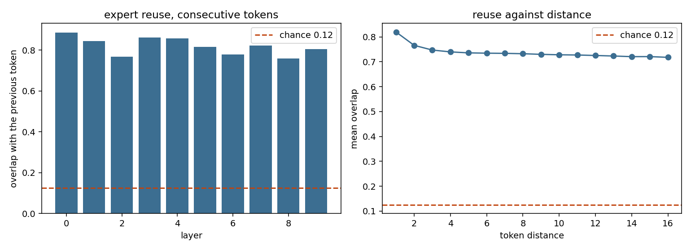
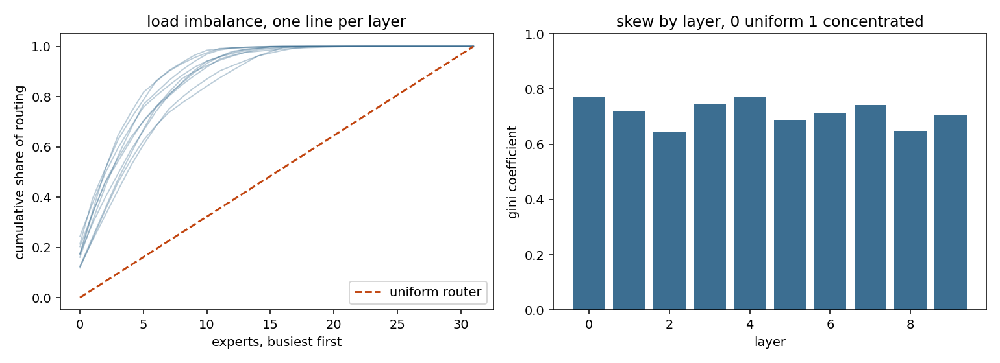
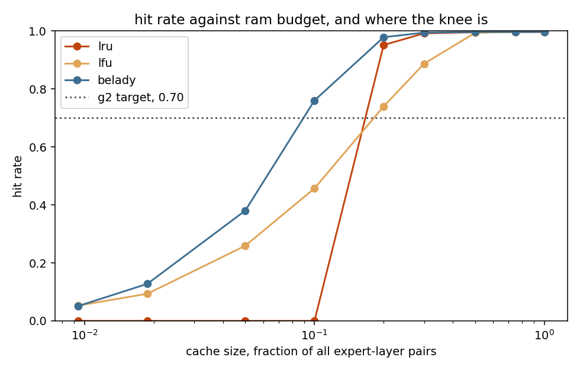
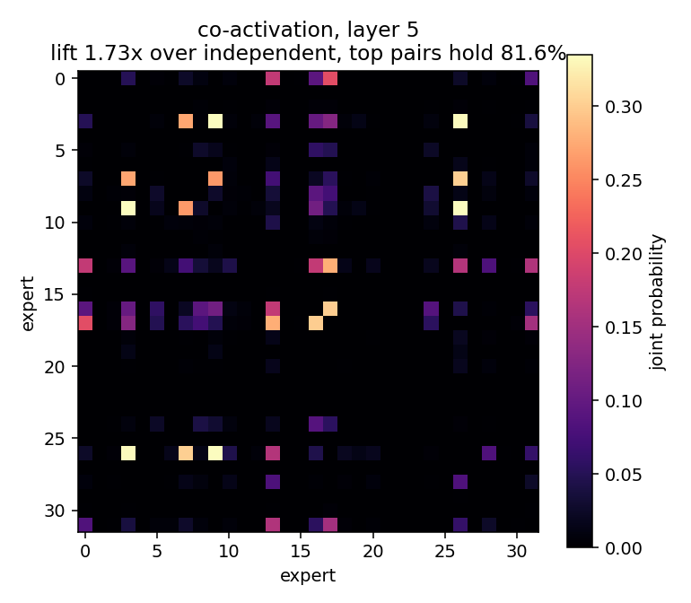
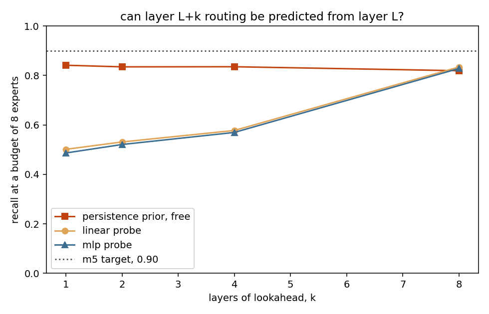

# m0: does the structure strata depends on actually exist

> ## this is not a measurement
>
> SYNTHETIC trace, generated structure, not a measurement. nominal model synthetic-10L-32E-top4. persistence 0.3, skew 1.0, signal 0.8, 4 domains in blocks of 250
>
> the numbers below describe a trace that was generated with the structure the design assumes, so of course it exhibits that structure. this run exercises the harness end to end. it says nothing whatsoever about any real model, and none of it belongs in a writeup.

```
1500 tokens x 10 layers x top-4 of 32 experts, hidden dim 64
SYNTHETIC trace, generated structure, not a measurement. nominal model synthetic-10L-32E-top4. persistence 0.3, skew 1.0, signal 0.8, 4 domains in blocks of 250
```

## verdict

**stop and reconsider.** 2 of 6 assumptions did not hold. the prd says to publish this as a short negative result and not to build the engine on it.

| check | verdict | measured | threshold | why it matters |
|---|---|---|---|---|
| expert reuse across consecutive tokens | **pass** | 0.820 | 0.300 | if consecutive tokens route to unrelated experts, nothing can be cached |
| router load imbalance | **pass** | 0.715 | 0.300 | a uniform router pins the hit rate to the ram ratio and no policy helps |
| co-activation lift over independent routing | **pass** | 1.615 | 1.300 | without it, laying the file out by co-activation buys nothing |
| achievable hit rate at 20% of experts resident | **pass** | 0.978 | 0.700 | g2 asks for 0.70, and belady is the ceiling any policy is measured against |
| layer L+4 routing predicted from layer L | **fail** | 0.578 | 0.900 | o2 is the project's research contribution and this is whether it exists |
| probe beats the free persistence prior at k=4 | **fail** | -0.258 | 0.000 | a probe that cannot beat a prior costing nothing should not be shipped |

## 1. reuse across tokens

reuse across consecutive tokens: 0.820 overall, 0.758 to 0.887 across layers. chance, if the router picked at random, would be 0.125.



the persistence prior is this number. it costs nothing, needs no model, and is the baseline the speculative router head has to beat before it is worth its complexity.

## 2. access skew

access skew: gini 0.715, normalised entropy 0.708, busiest tenth takes 43.2% of routing



## 3. hit rate against ram budget

| policy | hit rate at the target budget | smallest cache reaching 0.70 |
|---|---|---|
| lru | 0.952 | 64 pairs (20.0%) |
| lfu | 0.740 | 64 pairs (20.0%) |
| belady | 0.978 | 32 pairs (10.0%) |



this is the figure that answers the question every actual user has, which is how much ram they need for their model.

**lru reads 0.952 here and that is not a broken simulator.** one token touches 40 distinct expert-layer pairs, 10 layers at top-4, and the budget being judged holds 64. a cyclic scan over more distinct items than the cache holds evicts every one of them exactly before it is next needed, which is the worst case for pure recency, and it is not a rare corner: it is what a decoder does to any cache smaller than one token's working set.

the step is measured, not assumed. at 39 pairs lru gets 0.146, and at 40 pairs it gets 0.772.

that is the argument for admission control in one number. lfu reads 0.740 on the same trace at the same budget, because frequency survives a scan that recency cannot, and it is why the strata cache puts a probationary window in front of the main region rather than running one lru list.

## 4. co-activation structure

joint routing runs at **1.61x** what independent routing would produce, and the heaviest pairs account for **85.4%** of all joint mass.



lift near 1.0 would mean experts fire independently, in which case laying the file out by co-activation buys nothing and the storage design loses one of its two arguments.

## 5. multi-layer-ahead predictability

| k | prefetch budget | persistence prior | linear probe | mlp probe |
|---|---|---|---|---|
| 1 | 8 | 0.841 | 0.502 | 0.487 |
| 2 | 8 | 0.835 | 0.531 | 0.521 |
| 4 | 8 | 0.835 | 0.578 | 0.570 |
| 8 | 8 | 0.819 | 0.834 | 0.828 |



recall, not accuracy, because a false positive costs bandwidth and a false negative costs a full stall. prefetching a superset is fine.

## what this run does not measure

this model activates **12%** of its experts per layer per token, top-4 of 32. the models this project exists for are far sparser, and sparsity is not a detail here: it sets how much of the reuse, the skew and the hit rate is forced by the routing being dense rather than earned by structure the cache could exploit. a denser router mechanically raises reuse and lowers the value of any policy, so read every number above as coming from the unfavourable end for the prefetcher and the favourable end for the baseline. it is not a substitute for the same run on a sparse model.

the corpus is 1500 tokens. that is enough to separate the effects reported here and not enough to put a confidence interval on any of them beyond the one null that carries a p value.

---

generated by `strata_m0.report`. the raw numbers are in `summary.json`.
