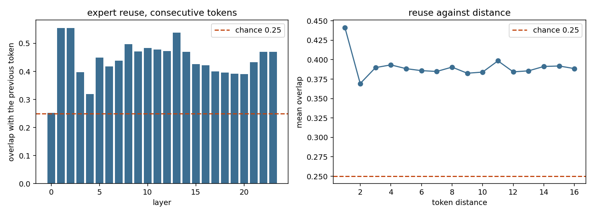
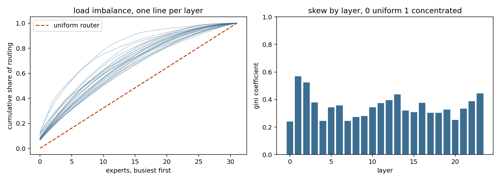
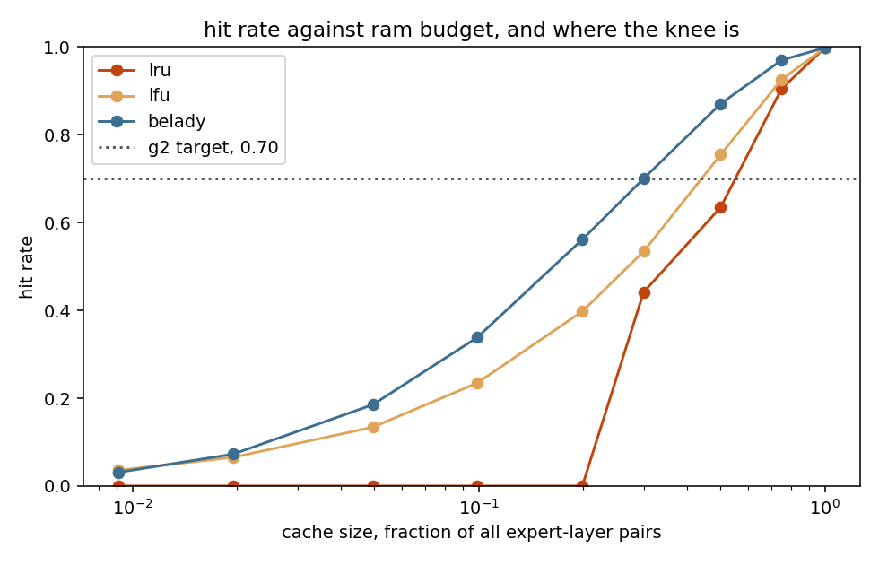
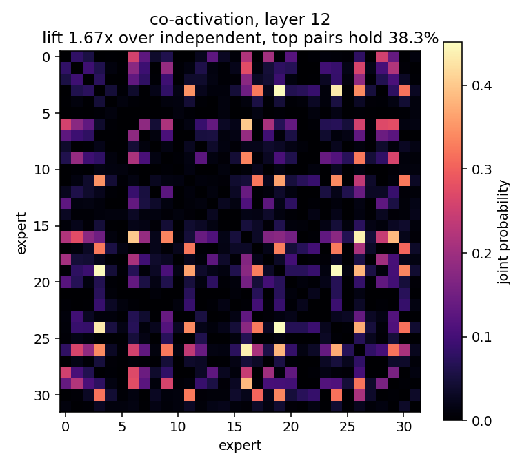
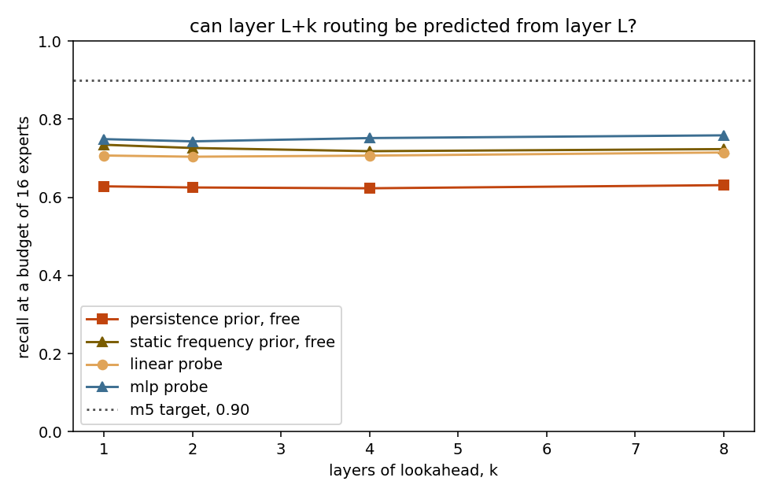

# m0: does the structure strata depends on actually exist

*captured from models/granite-1b-a400m on corpora/mixed-domains.txt*

```
2154 tokens x 24 layers x top-8 of 32 experts, hidden dim 1024, 4 segments
captured from models/granite-1b-a400m on corpora/mixed-domains.txt
```

## verdict

**stop and reconsider.** 1 of 7 assumptions did not hold. the prd says to publish this as a short negative result and not to build the engine on it.

| check | verdict | measured | threshold | why it matters |
|---|---|---|---|---|
| expert reuse across consecutive tokens | **marginal** | 0.441 | 0.500 | if consecutive tokens route to unrelated experts, nothing can be cached |
| router load imbalance | **pass** | 0.349 | 0.300 | a uniform router pins the hit rate to the ram ratio and no policy helps |
| co-activation lift over independent routing | **pass** | 1.530 | 1.300 | without it, laying the file out by co-activation buys nothing |
| achievable hit rate at 20% of experts resident | **marginal** | 0.561 | 0.700 | g2 asks for 0.70, and belady is the ceiling any policy is measured against |
| subject separation survives a circular shift null | **pass** | 0.006 | 0.000 | if routing is the same whatever the text is about, frequency buys nothing over recency and lru is the right policy |
| layer L+4 routing predicted from layer L | **marginal** | 0.752 | 0.900 | o2 is the project's research contribution and this is whether it exists |
| probe beats the best free baseline at k=4 | **fail** | 0.034 | 0.050 | a probe that barely beats a table costing nothing should not be shipped, and 0.05 recall is the least that could pay for one |

## 1. reuse across tokens

reuse across consecutive tokens: 0.441 overall, 0.253 to 0.555 across layers. chance, if the router picked at random, would be 0.250.



the persistence prior is this number. it costs nothing, needs no model, and it is one of the two free baselines a prefetcher has to beat. it is the weaker one. see section 5. and is the baseline the speculative router head has to beat before it is worth its complexity.

## 2. access skew

access skew: gini 0.349, normalised entropy 0.938, busiest tenth takes 22.0% of routing



## 3. hit rate against ram budget

| policy | hit rate at the target budget | smallest cache reaching 0.70 |
|---|---|---|
| lru | 0.000 | 576 pairs (75.0%) |
| lfu | 0.398 | 384 pairs (50.0%) |
| belady | 0.561 | 384 pairs (50.0%) |



this is the figure that answers the question every actual user has, which is how much ram they need for their model.

**lru reads 0.000 here and that is not a broken simulator.** one token touches 192 distinct expert-layer pairs, 24 layers at top-8, and the budget being judged holds 153. a cyclic scan over more distinct items than the cache holds evicts every one of them exactly before it is next needed, which is the worst case for pure recency, and it is not a rare corner: it is what a decoder does to any cache smaller than one token's working set.

the step is measured, not assumed. at 191 pairs lru gets 0.198, and at 192 pairs it gets 0.327.

that is the argument for admission control in one number. lfu reads 0.398 on the same trace at the same budget, because frequency survives a scan that recency cannot, and it is why the strata cache puts a probationary window in front of the main region rather than running one lru list.

## 4. co-activation structure

joint routing runs at **1.53x** what independent routing would produce, and the heaviest pairs account for **32.3%** of all joint mass.



lift near 1.0 would mean experts fire independently, in which case laying the file out by co-activation buys nothing and the storage design loses one of its two arguments.

## 4b. does routing depend on the subject

routing profiles are **0.964** similar between two windows of the same subject and **0.895** similar between windows of different subjects, a separation of **+0.069**. similarity is cosine over access counts across expert-layer pairs, which does not saturate the way set overlap does.

this is the claim the cache policy rests on. the eviction score is frequency based rather than purely recency based because a topic is supposed to have a stable expert set that survives a digression. a separation near zero would mean lru is the right policy and the extra machinery is not earning its place.

that separation cannot be read on its own. windows inside one subject are also adjacent in time, so some of it is temporal locality rather than subject matter. shifting the window positions circularly against the same boundaries keeps the block sizes, the contiguity and the time distances and destroys only the alignment with the actual subjects.

| | separation |
|---|---|
| observed | +0.069 |
| circular shift null, mean | +0.042 |
| circular shift null, p95 | +0.063 |
| margin over p95 | +0.006 |
| p over 200 shifts | 0.005 |

8 further shifts were discarded because they mapped each subject onto another subject and so reproduced the real boundaries exactly. the subjects here are close to equal length, which is what makes that happen, and scoring the observed value against copies of itself would have cost the test most of its power.

**the null already explains 60% of the separation.** what is left is real at p=0.005 and small. routing here is mostly a property of position in the text, not of what the text is about, and that is a weaker result than the prd assumes.

## 5. multi-layer-ahead predictability

| k | budget | persistence prior | static prior | linear probe | mlp probe | margin |
|---|---|---|---|---|---|---|
| 1 | 16 | 0.628 | 0.735 | 0.707 | 0.749 | +0.014 |
| 2 | 16 | 0.625 | 0.726 | 0.704 | 0.743 | +0.017 |
| 4 | 16 | 0.623 | 0.718 | 0.707 | 0.752 | +0.034 |
| 8 | 16 | 0.631 | 0.724 | 0.715 | 0.759 | +0.035 |



recall, not accuracy, because a false positive costs bandwidth and a false negative costs a full stall. prefetching a superset is fine.

**margin is against the better of the two free baselines**, not against the persistence prior alone. the static prior is a table of per-layer expert popularity built once when the model is profiled. it reads the hidden state never, it costs nothing in the decode loop, and here it beats the persistence prior at every k and beats the linear probe at every k.

read the margin column, not the probe column. the probe is the only thing in this table that has to be trained, shipped and run inside the decode loop, and what it buys over a table of counts is what it has to justify itself with.

note also that recall barely moves with k. that is not the good news it looks like. a predictor that is no worse eight layers out than one layer out is not using the lookahead, it is reproducing something that does not depend on k, and a static popularity table is exactly that. the flatness and the margin are the same fact.

## what this run does not measure

this model activates **25%** of its experts per layer per token, top-8 of 32. the models this project exists for are far sparser, and density is not a detail: it sets the chance baselines every result here is read against. random routing would reuse 0.250 of its experts between consecutive tokens, and both free priors the probe has to beat are high for the same reason. the models the design targets route nearer 3 to 6 percent, so every baseline here moves on them and none of these numbers transfers without being measured again.

which way they move is not known. it has not been measured here, and guessing the direction is the thing this harness exists to avoid.

the corpus is 2154 tokens. that is enough to separate the effects reported here and not enough to put a confidence interval on any of them beyond the one null that carries a p value.

---

generated by `strata_m0.report`. the raw numbers are in `summary.json`.
